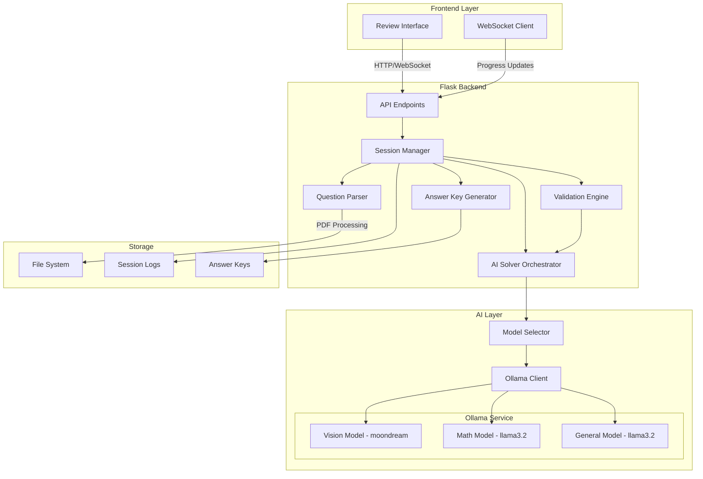

# Design Document: AI Question Solver

## Overview

The AI Question Solver extends the existing OMR Evaluation System to automatically generate answer keys from question bank PDFs using AI models. The system integrates with the current Flask backend and Ollama service to provide an end-to-end workflow: PDF upload → question extraction → AI solving → validation → review → answer key generation.

The design leverages the existing infrastructure (PyMuPDF for PDF processing, Ollama for AI models, Flask for API) while introducing new components for question parsing, AI solving orchestration, confidence scoring, and a review interface. The system is architected to handle 100-500 questions per session with performance targets of 2+ questions per minute.

Key design principles:
- Reuse existing PDF processing and Ollama integration patterns
- Fail gracefully with per-question error handling
- Provide transparency through confidence scores and explanations
- Enable human oversight through comprehensive review interface
- Maintain compatibility with existing OMR evaluation workflow

## Architecture

### System Components



### Component Responsibilities

**Question Parser**
- Detects document type (question bank vs answer key)
- Extracts individual questions with options from PDF pages
- Handles multi-page questions and image-based content
- Returns structured question objects with metadata

**AI Solver Orchestrator**
- Manages question solving workflow
- Coordinates with Model Selector for appropriate AI model
- Implements retry logic and timeout handling
- Generates explanations for each answer
- Tracks processing metrics

**Model Selector**
- Analyzes question content to determine question type
- Selects optimal AI model (math, vision, general knowledge)
- Manages model availability and fallback logic
- Provides model configuration to Ollama Client

**Validation Engine**
- Calculates confidence scores for AI-generated answers
- Validates logical consistency (option exists, explanation matches)
- Detects duplicate questions with different answers
- Flags uncertainty indicators in explanations
- Generates validation reports

**Session Manager**
- Orchestrates complete solver workflow
- Manages session state (active, paused, completed)
- Emits progress updates via WebSocket
- Handles pause/resume/cancel operations
- Persists session data for recovery

**Answer Key Generator**
- Compiles validated answers into answer key format
- Generates multiple export formats (JSON, CSV, PDF)
- Maintains compatibility with existing OMR evaluation
- Tracks manual corrections and metadata

### Data Flow

1. **Upload Phase**: User uploads PDF → API validates file → Session Manager creates new session
2. **Detection Phase**: Question Parser analyzes first 3 pages → Determines document type → Returns classification
3. **Extraction Phase**: Question Parser processes all pages → Extracts questions with options → Returns structured list
4. **Solving Phase**: For each question:
   - Model Selector determines question type and selects model
   - AI Solver sends question to Ollama with selected model
   - AI returns answer + explanation
   - Validation Engine calculates confidence score
   - Session Manager emits progress update
5. **Review Phase**: User reviews flagged/low-confidence answers → Makes corrections → Marks as verified
6. **Export Phase**: Answer Key Generator compiles final answer key → Exports in requested formats → Integrates with OMR workflow

### Integration Points

**Existing System Integration**
- Reuses `ollama_client.py` patterns for Ollama communication
- Extends `convert_pdf_to_image()` for question extraction
- Maintains answer key format compatibility with `evaluate()` endpoint
- Uses existing temp file management and cleanup patterns

**New API Endpoints**
- `POST /api/solve/upload` - Upload PDF and start solver session
- `GET /api/solve/session/<id>` - Get session status and results
- `POST /api/solve/session/<id>/pause` - Pause active session
- `POST /api/solve/session/<id>/resume` - Resume paused session
- `POST /api/solve/session/<id>/cancel` - Cancel session
- `PUT /api/solve/session/<id>/answer/<qnum>` - Update specific answer
- `POST /api/solve/session/<id>/approve` - Approve and finalize answer key
- `GET /api/solve/session/<id>/export` - Export answer key (JSON/CSV/PDF)
- `WebSocket /api/solve/progress` - Real-time progress updates

## Components and Interfaces

### Question Parser Module

**File**: `backend/question_parser.py`

**Classes**:

```python
@dataclass
class QuestionOption:
    """Represents a single answer option"""
    label: str  # A, B, C, D, E
    text: str
    has_image: bool = False
    image_data: Optional[bytes] = None

@dataclass
class Question:
    """Represents an extracted question"""
    number: int
    text: str
    options: List[QuestionOption]
    page_number: int
    has_image: bool = False
    image_data: Optional[bytes] = None
    question_type: Optional[str] = None  # math, logical, factual, visual

@dataclass
class DocumentClassification:
    """Result of document type detection"""
    doc_type: str  # "question_bank" or "answer_key"
    confidence: float  # 0.0 to 1.0
    reasoning: str

class QuestionParser:
    """Extracts questions from PDF documents"""
    
    def classify_document(self, pdf_path: str) -> DocumentClassification:
        """
        Analyzes first 3 pages to determine document type.
        Returns classification with confidence score.
        """
        pass
    
    def extract_questions(self, pdf_path: str) -> List[Question]:
        """
        Extracts all questions from a question bank PDF.
        Returns list of Question objects with metadata.
        Handles multi-page questions and image content.
        """
        pass
    
    def _detect_question_type(self, question: Question) -> str:
        """
        Analyzes question text to determine type.
        Returns: "math", "logical", "factual", or "visual"
        """
        pass
```

**Key Methods**:
- `classify_document()`: Uses pattern matching to detect question numbers, option labels, and answer indicators
- `extract_questions()`: Converts PDF pages to images, uses OCR/vision model to extract text, parses structure
- `_detect_question_type()`: Keyword analysis for math terms, logical operators, factual patterns

### AI Solver Module

**File**: `backend/ai_solver.py`

**Classes**:

```python
@dataclass
class SolverConfig:
    """Configuration for AI solver"""
    timeout_seconds: int = 30
    max_retries: int = 2
    retry_backoff_base: float = 2.0
    min_confidence_threshold: float = 0.6

@dataclass
class SolverResult:
    """Result from solving a single question"""
    question_number: int
    selected_option: Optional[str]  # A, B, C, D, E or None
    explanation: str
    confidence: float
    processing_time_ms: float
    status: str  # "solved", "unsolvable", "timeout", "error"
    error_message: Optional[str] = None

class ModelSelector:
    """Selects appropriate AI model for question type"""
    
    def __init__(self):
        self.model_map = {
            "math": "llama3.2:latest",
            "logical": "llama3.2:latest",
            "factual": "llama3.2:latest",
            "visual": "moondream:latest"
        }
        self.default_model = "llama3.2:latest"
    
    def select_model(self, question: Question) -> str:
        """Returns model name based on question type"""
        pass
    
    def is_model_available(self, model_name: str) -> bool:
        """Checks if model is available in Ollama"""
        pass

class AISolver:
    """Orchestrates AI-based question solving"""
    
    def __init__(self, config: SolverConfig = None):
        self.config = config or SolverConfig()
        self.model_selector = ModelSelector()
        self.ollama_client = OllamaClient()
    
    def solve_question(self, question: Question) -> SolverResult:
        """
        Solves a single question using appropriate AI model.
        Implements retry logic and timeout handling.
        Returns SolverResult with answer and metadata.
        """
        pass
    
    def _build_prompt(self, question: Question) -> str:
        """
        Constructs prompt for AI model.
        Includes question text, options, and instructions.
        """
        pass
    
    def _parse_ai_response(self, response: str) -> Tuple[str, str]:
        """
        Parses AI response to extract answer and explanation.
        Returns (selected_option, explanation)
        """
        pass
```

**Prompt Engineering**:

The system uses structured prompts to ensure consistent AI responses:

```
You are solving a multiple-choice question. Analyze the question carefully and select the correct answer.

Question {number}: {question_text}

Options:
A) {option_a_text}
B) {option_b_text}
C) {option_c_text}
D) {option_d_text}
[E) {option_e_text}]

Instructions:
1. Read the question and all options carefully
2. Reason through the problem step by step
3. Select the single best answer
4. Provide a brief explanation for your choice

Response format:
ANSWER: [A/B/C/D/E]
EXPLANATION: [Your reasoning in 2-3 sentences]
```

### Validation Engine Module

**File**: `backend/validation_engine.py`

**Classes**:

```python
@dataclass
class ValidationIssue:
    """Represents a validation problem"""
    question_number: int
    severity: str  # "critical", "warning", "info"
    issue_type: str  # "invalid_option", "explanation_mismatch", "uncertainty", etc.
    description: str

@dataclass
class ValidationReport:
    """Complete validation results"""
    total_questions: int
    issues: List[ValidationIssue]
    flagged_questions: Set[int]
    average_confidence: float

class ValidationEngine:
    """Validates AI-generated answers for consistency"""
    
    def calculate_confidence(self, result: SolverResult, question: Question) -> float:
        """
        Calculates confidence score based on multiple factors:
        - Explanation quality (length, specificity)
        - Uncertainty indicators in text
        - Processing time (very fast or very slow = lower confidence)
        - Model's inherent confidence if available
        
        Returns: float between 0.0 and 1.0
        """
        pass
    
    def validate_answer(self, result: SolverResult, question: Question) -> List[ValidationIssue]:
        """
        Validates a single answer for logical consistency.
        Checks:
        - Selected option exists in question
        - Explanation doesn't contradict answer
        - No uncertainty phrases in explanation
        
        Returns: list of ValidationIssue objects
        """
        pass
    
    def validate_batch(self, results: List[SolverResult], questions: List[Question]) -> ValidationReport:
        """
        Validates all answers and detects cross-question issues.
        Checks:
        - Duplicate questions with different answers
        - Consistency patterns
        
        Returns: ValidationReport with all issues
        """
        pass
    
    def _detect_uncertainty(self, explanation: str) -> bool:
        """
        Detects uncertainty phrases in explanation.
        Phrases: "possibly", "might be", "unclear", "not sure", etc.
        """
        pass
    
    def _check_explanation_match(self, selected: str, explanation: str, options: List[QuestionOption]) -> bool:
        """
        Verifies explanation discusses the selected option.
        Returns True if explanation matches selected answer.
        """
        pass
```

### Session Manager Module

**File**: `backend/session_manager.py`

**Classes**:

```python
@dataclass
class SessionState:
    """Represents solver session state"""
    session_id: str
    status: str  # "pending", "processing", "paused", "completed", "cancelled", "error"
    pdf_path: str
    total_questions: int
    processed_count: int
    solved_count: int
    unsolvable_count: int
    error_count: int
    start_time: float
    end_time: Optional[float]
    questions: List[Question]
    results: Dict[int, SolverResult]  # question_number -> result
    validation_report: Optional[ValidationReport]
    user_corrections: Dict[int, str]  # question_number -> corrected_answer
    user_notes: Dict[int, str]  # question_number -> note

class SessionManager:
    """Manages solver session lifecycle"""
    
    def __init__(self):
        self.active_sessions: Dict[str, SessionState] = {}
        self.session_locks: Dict[str, threading.Lock] = {}
    
    def create_session(self, pdf_path: str) -> str:
        """
        Creates new solver session.
        Returns session_id.
        """
        pass
    
    def start_processing(self, session_id: str) -> None:
        """
        Starts question solving process.
        Runs in background thread with progress updates.
        """
        pass
    
    def pause_session(self, session_id: str) -> bool:
        """Pauses active session. Returns success status."""
        pass
    
    def resume_session(self, session_id: str) -> bool:
        """Resumes paused session. Returns success status."""
        pass
    
    def cancel_session(self, session_id: str) -> bool:
        """Cancels session and discards results. Returns success status."""
        pass
    
    def update_answer(self, session_id: str, question_num: int, new_answer: str) -> bool:
        """
        Updates answer for specific question (manual correction).
        Marks as user-verified with confidence 1.0.
        """
        pass
    
    def add_note(self, session_id: str, question_num: int, note: str) -> bool:
        """Adds user note to specific question."""
        pass
    
    def get_session(self, session_id: str) -> Optional[SessionState]:
        """Retrieves session state."""
        pass
    
    def save_session(self, session_id: str) -> None:
        """Persists session state to disk."""
        pass
    
    def load_session(self, session_id: str) -> Optional[SessionState]:
        """Loads session state from disk."""
        pass
    
    def _emit_progress(self, session_id: str) -> None:
        """Emits progress update via WebSocket."""
        pass
```

### Answer Key Generator Module

**File**: `backend/answer_key_generator.py`

**Classes**:

```python
@dataclass
class AnswerKeyMetadata:
    """Metadata for generated answer key"""
    session_id: str
    generation_time: str
    total_questions: int
    solved_count: int
    unsolvable_count: int
    manual_corrections: int
    average_confidence: float
    approved: bool
    approved_by: Optional[str]
    approved_at: Optional[str]

class AnswerKeyGenerator:
    """Generates answer keys in multiple formats"""
    
    def generate_json(self, session: SessionState) -> dict:
        """
        Generates JSON answer key compatible with OMR evaluation.
        Format: {0: 0, 1: 2, 2: 1, ...}  # question_idx -> option_idx (0-based)
        Includes metadata and unsolvable list.
        """
        pass
    
    def generate_csv(self, session: SessionState) -> str:
        """
        Generates CSV export with columns:
        question_number, correct_answer, confidence, explanation, modified
        Returns CSV string.
        """
        pass
    
    def generate_pdf_report(self, session: SessionState, output_path: str) -> str:
        """
        Generates PDF report showing all questions with answers highlighted.
        Includes confidence scores and flags.
        Returns path to generated PDF.
        """
        pass
    
    def get_metadata(self, session: SessionState) -> AnswerKeyMetadata:
        """Extracts metadata from session state."""
        pass
    
    def approve_answer_key(self, session_id: str, user_id: str) -> bool:
        """
        Marks answer key as approved and immutable.
        Records approval metadata.
        """
        pass
```

## Data Models

### Database Schema

The system uses file-based storage for session persistence with the following structure:

```
backend/
  solver_sessions/
    {session_id}/
      session.json          # SessionState serialized
      questions.json        # List of Question objects
      results.json          # Dict of SolverResult objects
      validation.json       # ValidationReport
      answer_key.json       # Final answer key
      answer_key.csv        # CSV export
      answer_key_report.pdf # PDF report
      logs/
        extraction.log      # Question extraction logs
        solving.log         # AI solving logs
        validation.log      # Validation logs
```

### Session State JSON Format

```json
{
  "session_id": "uuid-string",
  "status": "completed",
  "pdf_path": "/path/to/question_bank.pdf",
  "total_questions": 100,
  "processed_count": 100,
  "solved_count": 95,
  "unsolvable_count": 3,
  "error_count": 2,
  "start_time": 1234567890.123,
  "end_time": 1234567990.456,
  "user_corrections": {
    "15": "C",
    "42": "A"
  },
  "user_notes": {
    "15": "Original answer was B, but explanation was wrong"
  }
}
```

### Answer Key JSON Format

```json
{
  "answer_key": {
    "0": 0,
    "1": 2,
    "2": 1
  },
  "metadata": {
    "session_id": "uuid-string",
    "generation_time": "2024-01-15T10:30:00Z",
    "total_questions": 100,
    "solved_count": 95,
    "unsolvable_count": 3,
    "manual_corrections": 2,
    "average_confidence": 0.82,
    "approved": true,
    "approved_by": "admin_user",
    "approved_at": "2024-01-15T11:00:00Z"
  },
  "unsolvable": [23, 67, 89],
  "low_confidence": [15, 42, 78]
}
```

### WebSocket Progress Message Format

```json
{
  "session_id": "uuid-string",
  "status": "processing",
  "current_question": 45,
  "total_questions": 100,
  "processed_count": 45,
  "solved_count": 42,
  "unsolvable_count": 2,
  "error_count": 1,
  "elapsed_time_seconds": 1350,
  "estimated_remaining_seconds": 1650,
  "average_confidence": 0.78,
  "questions_per_minute": 2.0
}
```


## Correctness Properties

*A property is a characteristic or behavior that should hold true across all valid executions of a system-essentially, a formal statement about what the system should do. Properties serve as the bridge between human-readable specifications and machine-verifiable correctness guarantees.*

### Property Reflection

After analyzing all 15 requirements with 90+ acceptance criteria, I identified the following redundancies and consolidations:

**Redundancies Eliminated:**
- Properties 1.2 and 1.3 (document classification) can be combined into a single comprehensive classification property
- Properties 3.2 and 3.3 (model selection by question type) can be combined into one property about correct model selection
- Properties 4.1 and 4.2 (solver processing and output format) overlap - 4.2 subsumes 4.1's validation
- Properties 6.1 and 2.2 both validate option existence - consolidated into validation property
- Properties 7.2 and 7.3 (answer key format and metadata) can be combined into format validation
- Properties 8.1-8.7 are UI examples that don't need separate properties - consolidated into integration tests
- Properties 14.2 and 14.3 (statistics calculation) can be combined into one statistics property

**Properties Combined:**
- Question extraction properties (2.1, 2.2, 2.7) consolidated into comprehensive extraction property
- Timeout properties (4.6, 4.7) combined into single timeout handling property
- Error handling properties (10.2, 10.4, 10.5) combined into error recovery property
- Export format properties (12.1, 12.2) combined into multi-format export property

This reflection reduces ~70 potential properties to ~40 unique, non-redundant properties that provide comprehensive coverage.

### Properties

### Property 1: Document Classification Correctness

*For any* PDF document, when the Question_Parser classifies it, the classification should be "question_bank" if the document contains question numbers with options but no answer indicators, and "answer_key" if it contains answer indicators (filled bubbles, answer lists, or key patterns).

**Validates: Requirements 1.2, 1.3**

### Property 2: Classification Confidence Range

*For any* document classification result, the confidence score must be between 0.0 and 1.0 inclusive.

**Validates: Requirements 1.4**

### Property 3: Low Confidence Prompting

*For any* classification result with confidence below 0.7, the system should prompt the user to manually select the document type.

**Validates: Requirements 1.5**

### Property 4: Complete Question Extraction

*For any* question bank PDF with N questions, the Question_Parser should extract exactly N questions, each with question number, text, options, and page reference.

**Validates: Requirements 2.1, 2.2, 2.7**

### Property 5: Mathematical Notation Preservation

*For any* question containing mathematical symbols or notation, the extracted question text should preserve all symbols without corruption or loss.

**Validates: Requirements 2.3**

### Property 6: Multi-Page Question Combination

*For any* question that spans multiple pages, the Question_Parser should combine all content into a single question entry with complete text.

**Validates: Requirements 2.4**

### Property 7: Image Detection and Inclusion

*For any* question containing images, diagrams, or charts, the extracted Question object should have has_image=True and non-null image_data.

**Validates: Requirements 2.5**

### Property 8: Parse Error Recovery

*For any* question that fails to parse, the system should mark it as "parse_failed", log the error, and continue processing remaining questions without stopping.

**Validates: Requirements 2.6, 10.2**

### Property 9: Model Selection by Question Type

*For any* question, the Model_Selector should select a model appropriate for the question type (math model for mathematical questions, vision model for image questions, general model for factual questions).

**Validates: Requirements 3.2, 3.3, 4.3**

### Property 10: Model Fallback on Unavailability

*For any* requested model that is unavailable, the system should fall back to the default model and log a warning.

**Validates: Requirements 3.5**

### Property 11: Vision Capability Validation

*For any* image-based question, the selected model must have vision capabilities verified before processing.

**Validates: Requirements 3.6**

### Property 12: Valid Answer Option Selection

*For any* solved question, the selected answer option must be one of the valid options (A, B, C, D, or E) that exists in the question's option list.

**Validates: Requirements 4.2, 6.1**

### Property 13: Explanation Generation

*For any* question with status "solved", the SolverResult must include a non-empty explanation string.

**Validates: Requirements 4.4**

### Property 14: Unsolvable Question Handling

*For any* question where the AI cannot determine an answer with reasonable confidence, the status should be "unsolvable" and a reason must be provided.

**Validates: Requirements 4.5**

### Property 15: Timeout Enforcement and Handling

*For any* question, processing time should not exceed 30 seconds, and if it does, the status should be "timeout" and processing should continue with the next question.

**Validates: Requirements 4.6, 4.7**

### Property 16: Confidence Score Range

*For any* solved question, the calculated confidence score must be between 0.0 and 1.0 inclusive.

**Validates: Requirements 5.1**

### Property 17: Low Confidence Flagging

*For any* answer with confidence score below 0.6, the Validation_Engine should flag it for mandatory review.

**Validates: Requirements 5.3**

### Property 18: Confidence Categorization

*For any* confidence score, it should be categorized as high (0.8-1.0), medium (0.6-0.79), or low (0.0-0.59) according to the defined ranges.

**Validates: Requirements 5.4**

### Property 19: Confidence-Based Sorting

*For any* list of generated answers, when sorted for review prioritization, they should be ordered by confidence score in ascending order (lowest confidence first).

**Validates: Requirements 5.5**

### Property 20: Duplicate Question Consistency

*For any* set of questions with identical text, they should all have the same answer, or be flagged if they have different answers.

**Validates: Requirements 6.2**

### Property 21: Uncertainty Detection in Explanations

*For any* explanation containing uncertainty phrases ("possibly", "might be", "unclear", "not sure"), the question should be flagged for review.

**Validates: Requirements 6.5**

### Property 22: Validation Report Structure

*For any* validation report, it must contain total_questions count, a list of ValidationIssue objects with severity levels (critical, warning, info), and a set of flagged question numbers.

**Validates: Requirements 6.6**

### Property 23: OMR Format Compatibility

*For any* generated answer key, it must be in the format {question_idx: option_idx} with 0-based integer indices, compatible with the existing OMR evaluation system.

**Validates: Requirements 7.1, 7.2**

### Property 24: Answer Key Metadata Completeness

*For any* generated answer key, the metadata must include total_questions, solved_count, unsolvable_count, and average_confidence fields.

**Validates: Requirements 7.3**

### Property 25: CSV Export Format

*For any* CSV export, it must contain columns for question_number, correct_answer, confidence, and explanation, with one row per question.

**Validates: Requirements 7.4**

### Property 26: Unsolvable Question Handling in Answer Key

*For any* answer key with unsolvable questions, those positions should be marked as null in the answer_key dict and included in a separate unsolvable list.

**Validates: Requirements 7.5**

### Property 27: Manual Correction Tracking

*For any* answer that is manually corrected by a user, it should be marked as "manually verified" with confidence set to 1.0.

**Validates: Requirements 8.4**

### Property 28: Note Persistence

*For any* note added to a question, it should be stored and retrievable with the session state.

**Validates: Requirements 8.8**

### Property 29: Approval Gating

*For any* session, the "Approve Answer Key" action should only be enabled when all flagged questions have been reviewed.

**Validates: Requirements 8.9**

### Property 30: Progress Update Frequency

*For any* active solver session, progress updates should be emitted via WebSocket at regular intervals (every 5 seconds).

**Validates: Requirements 9.1**

### Property 31: Progress Message Completeness

*For any* progress update message, it must include current_question, total_questions, elapsed_time, and estimated_remaining fields.

**Validates: Requirements 9.2**

### Property 32: Pause and Resume State Preservation

*For any* solver session, pausing should save all current state, and resuming should continue from the exact same point with all processed answers intact.

**Validates: Requirements 9.3, 9.4**

### Property 33: Cancellation Cleanup

*For any* cancelled solver session, processing should stop immediately and partial results should be discarded (not saved).

**Validates: Requirements 9.5**

### Property 34: Completion Event Emission

*For any* solver session that completes processing all questions, a completion event with final statistics should be emitted.

**Validates: Requirements 9.6**

### Property 35: Service Availability Check

*For any* attempt to start a solver session when Ollama service is unavailable, the system should return an error message and prevent session initiation.

**Validates: Requirements 10.1**

### Property 36: Retry Logic with Exponential Backoff

*For any* solver error, the system should retry exactly 2 times with exponentially increasing delays before marking as "solver_error".

**Validates: Requirements 10.3, 10.4**

### Property 37: Page Conversion Error Recovery

*For any* PDF page that fails to convert, the system should log the error, skip questions on that page, and continue processing remaining pages.

**Validates: Requirements 10.5**

### Property 38: Session Error Log Accessibility

*For any* solver session, an error log should be maintained and accessible through the API.

**Validates: Requirements 10.6**

### Property 39: Concurrent Session Limiting

*For any* system state, there should be at most 2 concurrent solver sessions running, with additional sessions queued or rejected.

**Validates: Requirements 11.5**

### Property 40: Session Queueing with Position Notification

*For any* session creation request when at capacity, the session should be queued and the user notified of their queue position.

**Validates: Requirements 11.6**

### Property 41: Multi-Format Export Compatibility

*For any* completed session, the answer key should be exportable in JSON format (compatible with OMR system), CSV format (with required columns), and PDF report format.

**Validates: Requirements 12.1, 12.2**

### Property 42: Manual Correction Indicators

*For any* answer key export where manual corrections were made, all export formats should include a "modified" indicator for corrected answers.

**Validates: Requirements 12.4**

### Property 43: Answer Key Persistence and Retrieval

*For any* generated answer key, it should be stored with a timestamp and be retrievable by session_id.

**Validates: Requirements 12.6**

### Property 44: Unsupported Type Handling

*For any* question of an unsupported type, the system should mark it as "unsupported_type" and provide a reason explaining why it cannot be processed.

**Validates: Requirements 13.5**

### Property 45: Question Type Distribution Statistics

*For any* solver session, the system should calculate and provide statistics on the distribution of question types (math, logical, factual, visual).

**Validates: Requirements 13.6**

### Property 46: Comprehensive Solver Response Logging

*For any* AI solver response, the system should log the question, answer, confidence, processing time, and model used.

**Validates: Requirements 14.1**

### Property 47: Session Statistics Calculation

*For any* solver session, the system should calculate average confidence score and percentage of questions requiring manual correction.

**Validates: Requirements 14.2, 14.3**

### Property 48: Correction Logging for Analysis

*For any* user correction, the system should log both the original AI answer and the corrected answer for model improvement analysis.

**Validates: Requirements 14.4**

### Property 49: Authentication Enforcement

*For any* AI Question Solver API endpoint, unauthenticated requests should be rejected with an authentication error.

**Validates: Requirements 15.1**

### Property 50: Authorization for Approval

*For any* answer key approval request, only users with administrator privileges should be authorized to approve.

**Validates: Requirements 15.2**

### Property 51: Audit Logging

*For any* answer key generation or approval action, the system should log the action with user identification and timestamp.

**Validates: Requirements 15.3**

### Property 52: Concurrent Edit Prevention

*For any* solver session, the system should prevent simultaneous editing by multiple users through session locking.

**Validates: Requirements 15.4**

### Property 53: Answer Key Immutability After Approval

*For any* approved answer key, it should be marked as immutable, and any subsequent changes should create a new version rather than modifying the approved version.

**Validates: Requirements 15.5**


## Error Handling

### Error Categories

The system handles errors at multiple levels with different recovery strategies:

**1. Service-Level Errors (Critical)**
- Ollama service unavailable
- Disk space exhausted
- Out of memory

**Strategy**: Prevent operation initiation, return clear error message, suggest remediation steps

**2. Document-Level Errors (Recoverable)**
- PDF cannot be opened
- PDF is corrupted or encrypted
- Document type classification fails

**Strategy**: Return error to user, allow retry with different file, log for debugging

**3. Page-Level Errors (Recoverable)**
- Page cannot be converted to image
- OCR/vision extraction fails for page

**Strategy**: Log error, skip questions on affected page, continue with remaining pages, report skipped pages in results

**4. Question-Level Errors (Recoverable)**
- Question parsing fails
- AI solver timeout
- AI solver returns invalid response
- Model unavailable

**Strategy**: Mark question with error status, log details, continue with next question, include in error report

**5. Validation Errors (Warning)**
- Low confidence answer
- Uncertainty detected in explanation
- Duplicate questions with different answers

**Strategy**: Flag for review, include in validation report, allow user to correct

### Error Response Format

All API endpoints return consistent error responses:

```json
{
  "error": true,
  "error_type": "service_unavailable|document_error|processing_error|validation_error|auth_error",
  "message": "Human-readable error description",
  "details": {
    "affected_items": ["question_15", "question_42"],
    "error_count": 2,
    "suggestions": [
      "Check that Ollama is running",
      "Verify PDF is not password-protected"
    ]
  },
  "timestamp": "2024-01-15T10:30:00Z"
}
```

### Retry Logic

**AI Solver Retries**:
- Maximum 2 retries per question
- Exponential backoff: 2^attempt seconds (2s, 4s)
- Retry on: connection errors, timeout errors, invalid response format
- No retry on: unsupported question type, explicit "unsolvable" response

**Session Recovery**:
- Sessions automatically save state every 10 questions
- On crash/restart, sessions can be resumed from last checkpoint
- Checkpoint includes: processed questions, results, current position

### Logging Strategy

**Log Levels**:
- ERROR: Service failures, critical errors, unrecoverable issues
- WARNING: Validation issues, low confidence, retries
- INFO: Session start/end, progress milestones, user actions
- DEBUG: Individual question processing, model selection, API calls

**Log Files**:
- `backend/logs/solver_main.log` - Main application log
- `backend/solver_sessions/{session_id}/logs/extraction.log` - Question extraction details
- `backend/solver_sessions/{session_id}/logs/solving.log` - AI solving details per question
- `backend/solver_sessions/{session_id}/logs/validation.log` - Validation issues and flags
- `backend/solver_sessions/{session_id}/logs/errors.log` - All errors for session

**Log Rotation**:
- Daily rotation for main log
- Session logs retained for 30 days
- Automatic cleanup of old session directories

### Timeout Configuration

| Operation | Timeout | Behavior on Timeout |
|-----------|---------|---------------------|
| PDF to Image Conversion | 10s per page | Skip page, log error |
| Question Extraction (per page) | 30s | Skip page, log error |
| AI Solver (per question) | 30s | Mark as timeout, continue |
| Session Pause/Save | 10s | Force save, may lose recent data |
| WebSocket Connection | 60s idle | Reconnect automatically |

## Testing Strategy

### Dual Testing Approach

The AI Question Solver requires both unit tests and property-based tests for comprehensive coverage:

**Unit Tests**: Verify specific examples, edge cases, error conditions, and integration points
**Property Tests**: Verify universal properties across all inputs through randomization

Both approaches are complementary and necessary. Unit tests catch concrete bugs in specific scenarios, while property tests verify general correctness across a wide input space.

### Property-Based Testing Configuration

**Framework**: Use `hypothesis` library for Python property-based testing

**Configuration**:
- Minimum 100 iterations per property test (due to randomization)
- Deadline: 60 seconds per test (some tests involve AI calls)
- Database: `.hypothesis/examples/` for failure reproduction
- Seed: Random by default, fixed for CI/CD reproducibility

**Test Tagging**:
Each property test must reference its design document property using a comment tag:

```python
# Feature: ai-question-solver, Property 12: Valid Answer Option Selection
@given(question=question_strategy(), solver_result=solver_result_strategy())
def test_selected_option_is_valid(question, solver_result):
    """For any solved question, the selected answer must be a valid option"""
    if solver_result.status == "solved":
        assert solver_result.selected_option in [opt.label for opt in question.options]
```

### Test Organization

```
backend/tests/
  test_question_parser.py          # Unit + property tests for parsing
  test_ai_solver.py                # Unit + property tests for solving
  test_model_selector.py           # Unit tests for model selection
  test_validation_engine.py        # Unit + property tests for validation
  test_session_manager.py          # Unit tests for session lifecycle
  test_answer_key_generator.py     # Unit + property tests for export
  test_api_endpoints.py            # Integration tests for API
  test_websocket_progress.py       # Integration tests for WebSocket
  test_error_handling.py           # Unit tests for error scenarios
  test_authentication.py           # Unit tests for auth/authz
  
  strategies/
    question_strategies.py         # Hypothesis strategies for Question objects
    solver_strategies.py           # Hypothesis strategies for SolverResult objects
    pdf_strategies.py              # Strategies for generating test PDFs
```

### Property Test Examples

**Property 4: Complete Question Extraction**
```python
# Feature: ai-question-solver, Property 4: Complete Question Extraction
@given(pdf=pdf_with_known_questions(min_questions=1, max_questions=50))
def test_complete_extraction(pdf):
    """For any question bank PDF with N questions, extract exactly N questions"""
    parser = QuestionParser()
    questions = parser.extract_questions(pdf.path)
    assert len(questions) == pdf.expected_question_count
    for q in questions:
        assert q.number is not None
        assert q.text
        assert len(q.options) >= 3
        assert q.page_number > 0
```

**Property 15: Timeout Enforcement**
```python
# Feature: ai-question-solver, Property 15: Timeout Enforcement and Handling
@given(question=question_strategy())
@settings(deadline=35000)  # 35s to allow for 30s timeout + overhead
def test_timeout_enforcement(question, monkeypatch):
    """For any question, processing should not exceed 30 seconds"""
    # Mock AI to take 31 seconds
    def slow_solve(*args, **kwargs):
        time.sleep(31)
        return "A", "explanation"
    
    monkeypatch.setattr('ai_solver.call_ollama', slow_solve)
    
    solver = AISolver()
    start = time.time()
    result = solver.solve_question(question)
    duration = time.time() - start
    
    assert duration <= 31  # Should timeout and return quickly
    assert result.status == "timeout"
```

**Property 32: Pause and Resume State Preservation**
```python
# Feature: ai-question-solver, Property 32: Pause and Resume State Preservation
@given(
    questions=st.lists(question_strategy(), min_size=10, max_size=20),
    pause_at=st.integers(min_value=3, max_value=7)
)
def test_pause_resume_preservation(questions, pause_at):
    """For any session, pausing and resuming should preserve all state"""
    manager = SessionManager()
    session_id = manager.create_session(questions)
    
    # Process until pause point
    for i in range(pause_at):
        manager.process_next_question(session_id)
    
    state_before = manager.get_session(session_id)
    manager.pause_session(session_id)
    manager.resume_session(session_id)
    state_after = manager.get_session(session_id)
    
    assert state_before.processed_count == state_after.processed_count
    assert state_before.results == state_after.results
    assert state_after.status == "processing"
```

### Unit Test Coverage Requirements

**Minimum Coverage**: 80% line coverage for all modules

**Critical Paths Requiring 100% Coverage**:
- Authentication and authorization logic
- Answer key approval and immutability enforcement
- Session locking and concurrent access prevention
- Error handling and retry logic
- Data persistence and retrieval

### Integration Testing

**API Integration Tests**:
- Test complete workflow: upload → classify → extract → solve → review → export
- Test pause/resume/cancel operations
- Test WebSocket progress updates
- Test concurrent session limits
- Test authentication on all endpoints

**Ollama Integration Tests**:
- Test with actual Ollama service (requires test environment)
- Test model selection and fallback
- Test vision model with image questions
- Test timeout and error handling
- Mock Ollama for unit tests, use real service for integration tests

### Performance Testing

While not part of correctness properties, performance should be validated:

**Benchmarks**:
- Question extraction: 100 questions in < 60 seconds
- AI solving: 2+ questions/minute (text), 1+ questions/minute (images)
- Session state save: < 1 second for 500 questions
- WebSocket latency: < 100ms for progress updates

**Load Testing**:
- 2 concurrent sessions with 500 questions each
- Verify resource usage stays within limits
- Verify queueing works correctly at capacity

### Test Data

**Synthetic Test PDFs**:
- Generate PDFs with known questions and answers
- Include various question types (math, logical, factual)
- Include edge cases (multi-page questions, images, special characters)
- Store in `backend/tests/fixtures/pdfs/`

**Real-World Test Data**:
- Anonymized question banks from actual use cases
- Diverse subjects and difficulty levels
- Used for integration and acceptance testing
- Not committed to repository (too large)

### Continuous Integration

**CI Pipeline**:
1. Run unit tests (fast, no external dependencies)
2. Run property tests with fixed seed (reproducible)
3. Run integration tests with mocked Ollama
4. Generate coverage report
5. Run linting and type checking

**Nightly Build**:
1. Run full property test suite with random seed
2. Run integration tests with real Ollama service
3. Run performance benchmarks
4. Generate comprehensive test report

### Manual Testing Checklist

Before release, manually verify:
- [ ] Upload various PDF formats (scanned, digital, mixed)
- [ ] Test with question banks of different sizes (10, 100, 500 questions)
- [ ] Verify UI displays all information correctly
- [ ] Test pause/resume during long sessions
- [ ] Verify manual corrections persist correctly
- [ ] Test all export formats (JSON, CSV, PDF)
- [ ] Verify answer key works in OMR evaluation
- [ ] Test with different user roles (admin vs regular user)
- [ ] Verify error messages are clear and actionable
- [ ] Test WebSocket reconnection after network interruption

